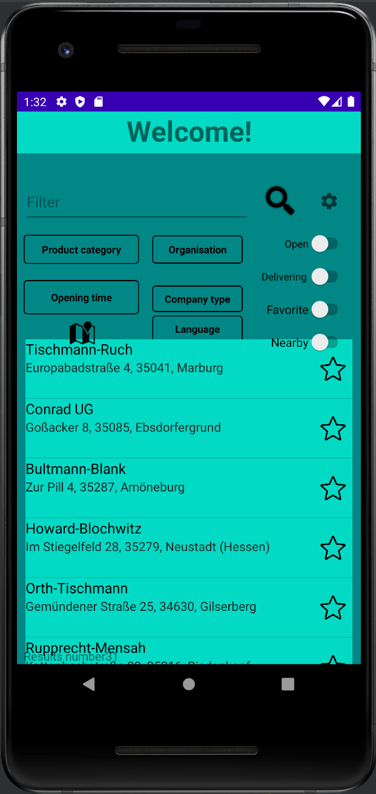

# RegionalApp-AndroidStudio
[RegionalApp-AndroidStudio](TestDoc.pdf)

This application is an android based application and coded with android studio, the language used is java. This application was coded "Softwarepraktikum" at the university in 2021. The main purpose of the application is to provide users with facilities such as filter search etc. within the application.

##### What can be done with this application?  ########
1 : With filter feature. For example: Search by address, opening time, owner, etc.

2 : choose store type

3 : choose category

4 : Store search

5 : Add a favorite stores list

6 : filtering language change

7 : filtering  Delivering

8 : close location with Circuit and Km

9 : select opening and closing time
